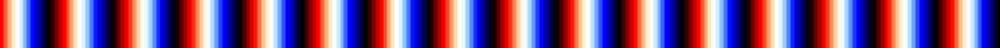

# js-colormaps

### Idea and Copyright
The idea of this project is to make the [colormaps of Python's matplotlib](http://matplotlib.org/examples/color/colormaps_reference.html) available in JavaScript. This also means: I did not invent any of the colormaps here, I do not own them, and I do not claim that I do. I just tried to make them available to others – so if I happen to violate any of your copyrights with this project, please inform me *before* you drag me to court and we can sort this thing out :)

Regarding my own copyrights: The project is released under the MIT license, which basically means "Do whatever you want" (but don't hold me liable!). I just started this because I needed a colormap in JS for another project, and Google did not spit out any good results, so I decided to do it myself and make it available to the public :)

### What is a colormap?
Well, if you have found this repository I presume you already know what a colormap is, but I will explain it anyways (maybe my idea of a colormap is fundamentally wrong after all?). A colormap is technically/mathematically a map $[0,1] \to [0, 255]^3$, i.e. a function that maps every value between 0 and 1 to a triplet of values between 0 and 255. These triplets can be interpreted as RGB-values, and thus, colors. So basically, every number between 0 and 1 is assigned a color.

Colormaps are useful for all sorts of data visualization. Usually the colors are used to encode another dimension: For example if you have a 2D map of the Alps, you could use different colors to encode the different heights of the terrain. Admittedly, in this case you could also use a 3D-plot, but if you print that to a 2D piece of paper you will lose information again). Another example is if you want to visualize a function $\mathbb{C} \to \mathbb{C}$, i.e. a function that takes a complex number as an argument and returns a complex number (in this case you will need a 3D plot *plus* colors, because you are dealing with four dimensions).

Of course a lot of the time the values you want to colorcode are not between 0 and 1. In this case you will have to scale them accordingly. You can either do that linearly, or exponentially, or using whatever other meaningful bijective function you can come up with... it really depends on your data :)

### How to use this thing
Most of the magic is in `js-colormaps.js`. This file contains a variable for every colormap, which includes a bunch of points between 0 and 1 and the corresponding colors. All other colors are interpolated linearly from these sampling points. I originally meant to come up with a more sophisticated approach, but some colormaps are really hard to fit with simple functions (polynomials), so I guess this will have to wait until I have the time to dive into the whole B-spline-thing.

To use the colormaps, load `js-colormaps.js` (or maybe just the colormaps that are relevant to you), and then use the `interpolateLinearly(x, values)` function from the `overview.html`. `x` is the value between 0 and 1 that you want to map onto a color, and `values` is the variable containing the colormap (i.e. one of the variables from `js-colormaps.js`). For example, you might do:

	var color = interpolateLinearly(0.5, Greens);

Generally it might be a good idea to just look into the `overview.html` to see how things work :)

### Why are the colormaps really maps $[0,1] \to [0,1]^3$? 
If you look into the code, you might notice that my colormaps do not return triples between 0 and 255, but rather triplets between 0 and 1, and that you have to do something like this to get them into the correct range:

	var color = interpolateLinearly(0.31415926, SomeColormap);
	r = Math.round(255*color[0]);
	g = Math.round(255*color[1]);
	b = Math.round(255*color[2]);

I honestly do not have a good answer to that. It was just a design choice I made, and I might change it later. Probably it was inspired by the fact that RGB-values in matplotlib are of the form $[0,1]^3$ and not $[0,255]^3$ as well.

### Enough blah blah, I want to see color maps!
All colormaps available here [can be seen here](http://matplotlib.org/examples/color/colormaps_reference.html). You can also open the `overview.html` for a nice, but JavaScript heavy overview. If that is too much of a hassle for you, here are five examples ;-)

**jet:** 
**Greens:** 
**seismic:** 
**Accent:** 
**flag:** 

### Which colormap should you choose?
I don't know, it's your choice ;-) All I can tell you is that jet (the current matplotlib default a.k.a. "rainbow") is a pretty bad colormap, and that you should probably go for something else. To get started, I recommend the following read: [How Bad Is Your Colormap?](https://jakevdp.github.io/blog/2014/10/16/how-bad-is-your-colormap/), and the references therein.