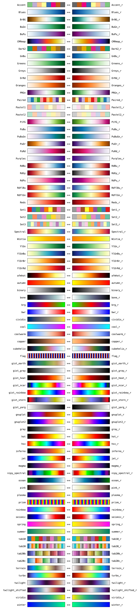

# js-colormaps


## 💡Idea: matplotlib colormaps for JavaScript

The idea of this project is simple: make the [colormaps of Python's matplotlib library](http://matplotlib.org/examples/color/colormaps_reference.html) available in JavaScript. I came up with it because I needed a colormap in JavaScript for a side project of mine and Google did not spit out any good results, so I decided to do it myself and make it available to the public.


## 🎨 What is a colormap?

If you have found this repository I presume you already know what a colormap is, but just for completeness’ sake, a colormap formally is a function *f*: [0, 1] → [0, 255]³ that maps a _number_ onto a _color_, represented by a triplet of 8-bit integers (= the **r**ed, **g**reen, **b**lue values). Or at least that is the convention that I have adopted for this project. Of course, a lot of the time the values you want to colorcode are not between 0 and 1 — in this case, you will have to rescale them first.


## 🚀 How can I use the colormaps?

Most of the magic is contained in the `js-colormaps.js` file, which you need to include like:

```html
<script src="js-colormaps.js"></script>
```

Once you have loaded that file, you have either use the function `evaluate_cmap(x, name, reverse)`  to map a value `x` onto a color using the colormap specified by `name` and `reverse`:

```javascript
>> evaluate_cmap(0.5, 'viridis', false)
Array(3) [ 33, 144, 140 ]
```

Alternatively, you can also directly access every colormap by its name (using the `_r` suffix to reverse it):

```javascript
>> RdBu_r(0.25)
Array(3) [ 106, 172, 208 ]
```


## 🌈 Which colormaps are available?

[All of matplotlib’s colormaps](https://matplotlib.org/stable/tutorials/colors/colormaps.html) are available, under the same name that you would use in Python: 



*(Feel free to check out the `overview.html` file to see how this overview figure was created.)*

Additionally, it should not be too hard to modify the code in `create-colormaps.py` to also export other Python-based colormaps to JavaScript, for example, the [scientific colour maps](https://www.fabiocrameri.ch/colourmaps/) by Fabio Crameri.


## ⚖️ Copyright

I did not invent any of the colormaps here, I do not own them, and I do not claim that I do. I just tried to make them available to others. If I happen to violate any of your copyrights with this project, please inform me *before* you drag me to court and we can sort this thing out :-)

Regarding my own copyrights: The project is released under the MIT license (see [LICENSE](https://github.com/timothygebhard/js-colormaps/blob/master/LICENSE) file), which pretty much means “Do whatever you want, but don't hold me liable!”.

